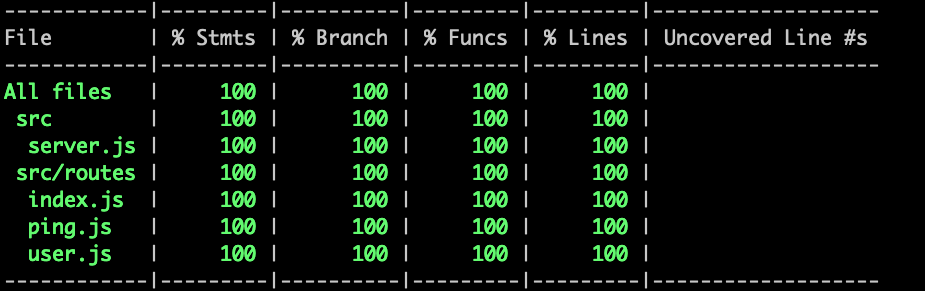

# hapi newman tests

Determining coverage of server code using newman and existing postman collections.

## Steps to run the demo

Install the package dependencies

```shell
npm install
```

Run test script

```shell
npm run test
```

Following this, you will be able to see the coverage in your terminal like:



In case you want to view the detailed coverage report, run the following command to launch it in your browser

```shell
open ./coverage/lcov-report/index.html
```

## How this works

The src folder contains the code of a normal hapi server.

The file `newman-test.json` contains the postman collection of API requests you would run against the server.

In `tests/newman.test.js`, we have a single `jest` testcases that starts the server, runs the postman collection using `newman` and then stops the server. This allows us to gauge the code covered by our postman collection.
 